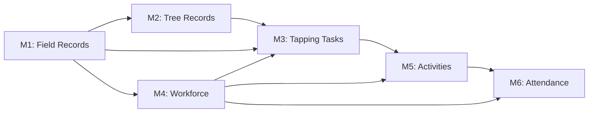

<p align="center">
  
  
  
  
  
  
  
  
</p>

# 🌿 RPMS — Rubber Plantation Management System

> **Design & Architecture Repository**
> Complete system design artifacts for an enterprise-grade rubber plantation management platform — database schemas, architecture diagrams, ER models, architecture decision records, and technical specifications.

---

## Table of Contents

- [Project Overview](#project-overview)
- [System Architecture](#system-architecture)
- [Modular Pluggable Architecture](#modular-pluggable-architecture)
- [Phase 1 Modules](#phase-1-modules)
- [Database Design Summary](#database-design-summary)
- [Technology Stack](#technology-stack)
- [Repository Map](#repository-map)
- [This Repository Structure](#this-repository-structure)
- [Module Quick Links](#module-quick-links)
- [Getting Started](#getting-started)
- [Cross-Module Relationships](#cross-module-relationships)
- [Design Principles](#design-principles)
- [Architecture Decision Records](#architecture-decision-records)
- [Roadmap](#roadmap)
- [License](#license)

---

## Project Overview

RPMS is a comprehensive enterprise platform for managing rubber plantation operations end-to-end — from planting and tree tracking through daily tapping operations to workforce management and payroll-ready attendance. The system integrates modern technologies across the full stack:

| Capability | Technology |
|---|---|
| **IoT Integration** | Smart tapping knives, GPS wearables, NFC tree tags, rain gauges, BLE geofence beacons |
| **Blockchain** | Hyperledger Fabric for tamper-proof yield provenance, attendance records, sustainability certification |
| **Generative AI** | Natural language querying (RAG copilot), photo analysis (tapping quality, disease detection), yield prediction |
| **AR/MR** | Mobile AR tree data overlay, tapping cut guides, MR training stations, VR stakeholder walkthroughs |
| **Mobile** | Kotlin Multiplatform with Jetpack Compose — full native Android access for BLE, NFC, CameraX, GPS |

### Why RPMS?

Rubber plantations manage millions of trees across thousands of hectares, with daily operations generating enormous amounts of field data — tapping records, latex yield, tree health, worker attendance, material usage. Most estates still rely on paper forms and spreadsheets. RPMS digitizes the entire operation with field-level GPS tracking, real-time IoT telemetry, AI-powered insights, and blockchain-anchored traceability — all accessible from a tapper's Android phone to a manager's web dashboard.

---

## System Architecture

> 📄 **Interactive diagram**: Open [`architecture/rpms_high_level_architecture.html`](architecture/rpms_high_level_architecture.html) in a browser for the full 4-tab interactive architecture view.

The system follows a **modular pluggable microservices architecture** with event-driven communication, edge computing, and a shared PostgreSQL database:

```
┌─────────────────────────────────────────────────────────────────────┐
│  EDGE / FIELD DEVICES                                               │
│  Smart Knife · GPS Band · NFC Tags · Rain Gauge · AR/MR · Scale    │
└──────────────────────────────┬──────────────────────────────────────┘
                               ▼
┌─────────────────────────────────────────────────────────────────────┐
│  FIELD EDGE GATEWAY  (per plantation — K3s)                         │
│  Mosquitto MQTT · Apache Camel · SQLite Cache · Biometric Unit      │
└──────────────────────────────┬──────────────────────────────────────┘
                               ▼
┌─────────────────────────────────────────────────────────────────────┐
│  CLIENT APPLICATIONS (Shell Compositors)                            │
│  Angular Shell (rpms-shell-web) · Android Shell (rpms-shell-mobile)│
│  Lazy-load module packages · Zero business logic · Plugin model     │
└──────────────────────────────┬──────────────────────────────────────┘
                               ▼
┌─────────────────────────────────────────────────────────────────────┐
│  API GATEWAY & SECURITY  (rpms-platform)                            │
│  Spring Cloud Gateway · Keycloak (OAuth2/OIDC) · Rate Limiting      │
└──────────────────────────────┬──────────────────────────────────────┘
                               ▼
┌─────────────────────────────────────────────────────────────────────┐
│  MODULE SERVICES  (one repo per module — independent CI/CD)         │
│  rpms-mod-plantation · rpms-mod-tree · rpms-mod-tapping             │
│  rpms-mod-workforce · rpms-mod-activity · rpms-mod-attendance       │
│  (Spring Boot 3)      (Spring Boot 3)   (Quarkus)                   │
│  (Spring Boot 3)      (Quarkus)         (Quarkus)                   │
└──────────────────────────────┬──────────────────────────────────────┘
                               ▼
┌─────────────────────────────────────────────────────────────────────┐
│  INTEGRATION & EVENT BACKBONE  (rpms-platform)                      │
│  Apache Kafka · Apache Camel · Debezium CDC · Temporal.io Sagas     │
└──────────────────────────────┬──────────────────────────────────────┘
                               ▼
┌──────────────────────────────┬──────────────────────────────────────┐
│  AI / ML & BLOCKCHAIN        │  DATA & STORAGE (shared)             │
│  Gen AI Copilot (LangChain)  │  PostgreSQL 16 + PostGIS             │
│  Vision (PyTorch/FastAPI)    │  TimescaleDB (IoT time-series)       │
│  Yield Prediction (XGBoost)  │  Redis 7 (cache)                     │
│  Anomaly Detection           │  Elasticsearch 8 (search)            │
│  Hyperledger Fabric          │  MinIO/S3 (objects) · pgvector (RAG) │
└──────────────────────────────┴──────────────────────────────────────┘
```

---

## Modular Pluggable Architecture

> 📄 **Full details**: See [ADR-006](architecture/architecture-decisions/ADR-006-modular-pluggable-architecture.md) and the [Implementation Guide](architecture/modular-architecture-implementation-guide.md).

RPMS uses a **modular pluggable architecture** where each business module lives in its own repository as a full vertical slice — backend service, Angular library, KMP mobile feature, Flyway migrations, API contract, and CI/CD pipeline. Thin shell applications lazy-load module packages at runtime.

### Core Principles

- **One repo per module** — each module has its own backend, frontend, migrations, and independent release cycle
- **Shared database** — all 60 tables, 39 lookups, 25 views, and 30 triggers remain in a single PostgreSQL instance with full referential integrity
- **Single writer, many readers** — each table has exactly one module that writes to it; any module can read from any table
- **Platform foundation** — shared Java libraries, Avro event schemas, Angular/KMP packages published as versioned artifacts from `rpms-platform`
- **Thin shell compositors** — `rpms-shell-web` (Angular) and `rpms-shell-mobile` (Compose) contain zero business logic; they compose module packages via lazy loading
- **Plugin model** — adding a Phase 2 module = 1 route + 1 nav entry + 1 dependency in each shell; zero changes to existing modules

### How Modules Plug In

**Angular (Web Dashboard):** Each module publishes an npm library (`@rpms/mod-tapping`, etc.) exporting routes, nav items, and providers. The shell's `app.routes.ts` lazy-loads them:

```typescript
{ path: 'tapping', loadChildren: () => import('@rpms/mod-tapping').then(m => m.TAPPING_ROUTES) }
```

**Android (Mobile Apps):** Each module publishes a Gradle artifact with a Compose Navigation graph. The shell composes them:

```kotlin
NavHost(navController, startDestination = "plantation") {
    plantationNavGraph(navController)   // from com.rpms:mod-plantation-kmp
    tappingNavGraph(navController)      // from com.rpms:mod-tapping-kmp
    // ...
}
```

**Backend:** Each module runs as an independent microservice behind the API Gateway. The gateway routes requests based on path prefix (`/api/tapping/**` → tapping-service).

---

## Phase 1 Modules

Each module's database design is complete with DDL, interactive diagrams, and Mermaid ER models.

| # | Module | Description | Framework | Tables | Views | Triggers |
|---|---|---|---|---|---|---|
| M1 | [Plantation Field Records](#m1-plantation-field-records) | Land classification, fields, nurseries, clone distribution, spatial boundaries | Spring Boot | 9 + 6 lu | 5 | 4 |
| M2 | [Tree Records & Tracking](#m2-tree-records--tracking) | Individual tree lifecycle, growth, disease, treatment, mortality, NFC/RFID tags | Spring Boot | 11 + 7 lu | 4 | 5 |
| M3 | [Tapping Task Monitoring](#m3-tapping-task-monitoring) | Daily tapping tasks, latex collection, quality testing, IoT telemetry, yield analytics | Quarkus | 11 + 6 lu | 4 | 6 |
| M4 | [Workforce Management](#m4-workforce-management) | Worker lifecycle, skills, gangs, leave, training, pay structure, safety | Spring Boot | 12 + 10 lu | 4 | 4 |
| M5 | [Daily Activity Monitoring](#m5-daily-activity-monitoring) | All plantation activities, material usage, photo evidence, inspections, AI analysis | Quarkus | 9 + 5 lu | 4 | 6 |
| M6 | [Attendance Management](#m6-attendance-management) | Multi-method attendance, shift roster, overtime, regularization, monthly payroll | Quarkus | 8 + 5 lu | 4 | 5 |
| | **TOTAL** | | | **60 + 39 lu** | **25** | **30** |

---

## Database Design Summary

```
Database Engine:    PostgreSQL 16 + PostGIS 3.4 + TimescaleDB + pgvector
Core Tables:        60
Lookup Tables:      39  (all pre-seeded with rubber plantation domain data)
Views:              25  (dashboards, analytics, alerts, payroll-ready)
Triggers:           30  (auto-calc, auto-sync, GPS, audit logging)
Geometry Types:     Point (trees, GPS), LineString (routes), Polygon (fields, geofence)
Partitioning:       iot_sensor_reading — range partitioned by month
Generated Columns:  worker.full_name, worker_leave_balance.remaining_days
Blockchain Fields:  blockchain_tx_hash on status logs, attendance, yield provenance
AI/ML Fields:       JSONB ai_analysis_result, ai_anomaly_flag, ai_efficiency_score
SRID:               4326 (WGS 84) on all spatial columns
Ownership Model:    Single writer per table, many readers (enforced via PostgreSQL permissions)
```

### Module Dependency Chain



### Flyway Migration Prefix Convention

Each module owns a migration prefix range, ensuring correct dependency ordering:

| Prefix | Owner | Example |
|---|---|---|
| V0_xxx | rpms-platform (shared lookups, views, triggers) | V0_001__extensions.sql, V0_002__shared_lookups.sql |
| V1_xxx | rpms-mod-plantation | V1_001__create_plantation.sql |
| V2_xxx | rpms-mod-tree | V2_001__create_tree.sql |
| V3_xxx | rpms-mod-tapping | V3_001__create_tapping_task.sql |
| V4_xxx | rpms-mod-workforce | V4_001__create_worker.sql |
| V5_xxx | rpms-mod-activity | V5_001__create_daily_work_plan.sql |
| V6_xxx | rpms-mod-attendance | V6_001__create_scan_log.sql |

---

## Technology Stack

| Layer | Technology | Purpose |
|---|---|---|
| **Backend (CRUD)** | Java 21 + Spring Boot 3 | Plantation, Tree, Workforce services — stable domain, rich ecosystem |
| **Backend (High-Throughput)** | Java 21 + Quarkus | Tapping, Activity, Attendance services — fast startup, low memory, burst scaling |
| **Platform Libraries** | rpms-common, rpms-security, rpms-spatial | Framework-agnostic shared DTOs, Keycloak JWT, PostGIS helpers |
| **Event Backbone** | Apache Kafka + Confluent Schema Registry (Avro) | Domain events, CDC, IoT telemetry, saga coordination |
| **Integration** | Apache Camel 4 | Edge (MQTT→Kafka) and cloud (external APIs, ERP sync) |
| **Orchestration** | Temporal.io | Saga pattern for cross-module transactions |
| **Mobile** | Kotlin Multiplatform + Jetpack Compose | Android apps (tapper + supervisor), native BLE/NFC/CameraX/GPS |
| **Web Dashboard** | Angular 18 + ngx-charts + ngx-mapbox-gl + RxJS | Management dashboard with real-time streaming, spatial visualization |
| **Shell Compositors** | Angular shell (web) + Compose Navigation shell (Android) | Thin apps that lazy-load module packages — plugin architecture |
| **API Gateway** | Spring Cloud Gateway + Keycloak (OAuth2/OIDC) | Routing, JWT relay, rate limiting, CORS |
| **Database** | PostgreSQL 16 + PostGIS + TimescaleDB + pgvector | Shared database — relational, spatial, time-series, vector search |
| **Cache** | Redis 7 | Tree profile cache, sessions, rate limiting, pub/sub |
| **Search** | Elasticsearch 8 | Full-text search, log aggregation, Kibana dashboards |
| **Object Storage** | MinIO / S3 | Photos, documents, certificates, AI model artifacts |
| **AI/ML** | Python + FastAPI + PyTorch + LangChain | Photo analysis, yield prediction, anomaly detection, Gen AI copilot |
| **Blockchain** | Hyperledger Fabric | Private chain for yield provenance, attendance anchoring |
| **Observability** | OpenTelemetry + Grafana + Prometheus + Loki + Tempo | Traces, metrics, logs, distributed tracing |
| **CI/CD** | GitHub Actions + ArgoCD + Terraform | Per-module pipelines, GitOps deployment to Kubernetes |
| **Container Orchestration** | Kubernetes (EKS/GKE) + K3s (edge) | Cloud production + lightweight plantation-edge clusters |

---

## Repository Map

RPMS uses a **modular pluggable architecture** with 10 repositories under the `rpms-plantation` GitHub organization:

```
rpms-plantation (GitHub Organization)
│
│  DESIGN
├── rpms-design                 ← You are here — DDL, diagrams, ADRs, API contracts
│
│  PLATFORM (foundation)
├── rpms-platform               ← Shared libs, event schemas, API gateway, infra, cross-cutting services
│
│  MODULES (one repo per module — full vertical slice)
├── rpms-mod-plantation         ← M1: Spring Boot backend + Angular lib + KMP feature + Flyway V1_xxx
├── rpms-mod-tree               ← M2: Spring Boot backend + Angular lib + KMP feature + Flyway V2_xxx
├── rpms-mod-tapping            ← M3: Quarkus backend + Angular lib + KMP feature + Flyway V3_xxx
├── rpms-mod-workforce          ← M4: Spring Boot backend + Angular lib + KMP feature + Flyway V4_xxx
├── rpms-mod-activity           ← M5: Quarkus backend + Angular lib + KMP feature + Flyway V5_xxx
├── rpms-mod-attendance         ← M6: Quarkus backend + Angular lib + KMP feature + Flyway V6_xxx
│
│  SHELLS (thin compositors — zero business logic)
├── rpms-shell-web              ← Angular shell: layout, sidebar, routing — lazy-loads @rpms/mod-* libs
└── rpms-shell-mobile          ← Android shell: Compose Navigation host — composes module nav graphs
```

### What Each Module Repo Contains

Every `rpms-mod-*` repository is a full vertical slice:

```
rpms-mod-{module}/
├── backend/              # Spring Boot or Quarkus service
│   ├── src/main/java/    # entity → repository → service → controller → dto → mapper → event
│   └── src/main/resources/db/migration/   # Flyway V{N}_xxx migrations
├── angular-lib/          # Publishable Angular library (@rpms/mod-{module})
│   └── src/lib/          # routes, nav items, providers, pages, components, services
├── kmp-feature/          # Publishable KMP Gradle module (com.rpms:mod-{module}-kmp)
│   ├── commonMain/       # Ktor client, SQLDelight, domain models, use cases
│   └── androidMain/      # Compose screens, navigation graph, hardware integration
├── api-contract/         # OpenAPI 3.0 YAML + Avro event schemas
├── k8s/                  # Kubernetes deployment, service, HPA manifests
└── .github/workflows/    # Independent CI/CD pipeline
```

### What rpms-platform Contains

The foundation that every module depends on:

```
rpms-platform/
├── shared-libs/          # Maven artifacts: rpms-common (DTOs), rpms-security (Keycloak), rpms-spatial (PostGIS)
├── event-schemas/        # Avro schemas for all Kafka domain events + topic registry
├── api-gateway/          # Spring Cloud Gateway + route config + Keycloak realm
├── services/             # Cross-cutting: notification-service, reporting-service
├── database/migrations/  # V0_xxx: extensions, 39 lookups, 25 cross-module views, cross-module triggers
├── angular-shared/       # @rpms/shared npm package: map-viewer, data-table, chart-panel, auth, interceptors
├── kmp-shared/           # com.rpms:shared-kmp: base domain models, Ktor client, sync engine
└── infra/                # Terraform, K8s base manifests, docker-compose.dev.yml, edge gateway
```

---

## This Repository Structure

```
rpms-design/
│
├── README.md                                    ← You are here
├── RPMS_PROJECT_CONTEXT.md                      ← Session continuity document for AI-assisted development
│
├── architecture/
│   ├── rpms_high_level_architecture.html         ← Interactive 4-tab architecture diagram (open in browser)
│   ├── rpms_artifact_storage_strategy.html       ← Repository strategy & directory trees
│   ├── modular-architecture-implementation-guide.md  ← Detailed implementation guide for modular architecture
│   ├── architecture-decisions/
│   │   ├── ADR-001-database-choice.md            ← PostgreSQL 16 + PostGIS + TimescaleDB + pgvector
│   │   ├── ADR-002-spring-vs-quarkus.md          ← Spring Boot (CRUD) + Quarkus (high-throughput) hybrid
│   │   ├── ADR-003-event-backbone.md             ← Apache Kafka + Confluent Schema Registry (Avro)
│   │   ├── ADR-004-angular-over-react.md         ← Angular 18 for web dashboard
│   │   ├── ADR-005-kmp-over-flutter.md           ← Kotlin Multiplatform for mobile
│   │   └── ADR-006-modular-pluggable-architecture.md  ← Modular repos with shared database
│   └── deployment-topology.mermaid
│
├── database/
│   ├── module-1-field-records/
│   │   ├── plantation_field_records_ddl.sql       ← Complete DDL + indexes + views + triggers + seed data
│   │   ├── plantation_db_design_diagrams.html     ← Interactive 4-tab dashboard (ER, schema, relationships, lifecycle)
│   │   ├── plantation_er_diagram.mermaid          ← Portable ER diagram
│   │   └── README.md
│   ├── module-2-tree-records/
│   │   ├── tree_records_tracking_ddl.sql
│   │   ├── tree_records_tracking_diagrams.html
│   │   ├── tree_records_tracking_er.mermaid
│   │   └── README.md
│   ├── module-3-tapping-task/
│   │   ├── tapping_task_monitoring_ddl.sql
│   │   ├── tapping_task_monitoring_diagrams.html
│   │   ├── tapping_task_monitoring_er.mermaid
│   │   └── README.md
│   ├── module-4-workforce/
│   │   ├── workforce_management_ddl.sql
│   │   ├── workforce_management_diagrams.html
│   │   ├── workforce_management_er.mermaid
│   │   └── README.md
│   ├── module-5-daily-activity/
│   │   ├── daily_activity_monitoring_ddl.sql
│   │   ├── daily_activity_monitoring_diagrams.html
│   │   ├── daily_activity_monitoring_er.mermaid
│   │   └── README.md
│   └── module-6-attendance/
│       ├── attendance_management_ddl.sql
│       ├── attendance_management_diagrams.html
│       ├── attendance_management_er.mermaid
│       └── README.md
│
├── api-contracts/                                ← OpenAPI 3.0 specs per service (when designed)
├── wireframes/                                   ← UI mockups (when designed)
├── domain-model/                                 ← Bounded contexts, event storming, glossary (when designed)
└── docs/                                         ← NFRs, security architecture, data flow diagrams (when designed)
```

---

## Module Quick Links

### M1: Plantation Field Records

| Artifact | Link |
|---|---|
| DDL Script | [`database/module-1-field-records/plantation_field_records_ddl.sql`](database/module-1-field-records/plantation_field_records_ddl.sql) |
| Interactive Diagrams | [`database/module-1-field-records/plantation_db_design_diagrams.html`](database/module-1-field-records/plantation_db_design_diagrams.html) |
| Mermaid ER | [`database/module-1-field-records/plantation_er_diagram.mermaid`](database/module-1-field-records/plantation_er_diagram.mermaid) |

**Key entities**: plantation, division, field (with PostGIS Polygon boundary), nursery, clone_master. Land use classification, field lifecycle history, annual area snapshots. Foundation module — referenced by all other modules via `plantation_id`, `division_id`, `field_id`.

### M2: Tree Records & Tracking

| Artifact | Link |
|---|---|
| DDL Script | [`database/module-2-tree-records/tree_records_tracking_ddl.sql`](database/module-2-tree-records/tree_records_tracking_ddl.sql) |
| Interactive Diagrams | [`database/module-2-tree-records/tree_records_tracking_diagrams.html`](database/module-2-tree-records/tree_records_tracking_diagrams.html) |
| Mermaid ER | [`database/module-2-tree-records/tree_records_tracking_er.mermaid`](database/module-2-tree-records/tree_records_tracking_er.mermaid) |

**Key entities**: tree (BIGSERIAL PK with PostGIS Point), tree_tag (NFC/RFID/QR/BLE), tree_health_inspection, tree_disease_incident, tree_treatment_record, tree_mortality_record. Auto-log status changes via trigger. Blockchain hash on `tree_status_change_log`.

### M3: Tapping Task Monitoring

| Artifact | Link |
|---|---|
| DDL Script | [`database/module-3-tapping-task/tapping_task_monitoring_ddl.sql`](database/module-3-tapping-task/tapping_task_monitoring_ddl.sql) |
| Interactive Diagrams | [`database/module-3-tapping-task/tapping_task_monitoring_diagrams.html`](database/module-3-tapping-task/tapping_task_monitoring_diagrams.html) |
| Mermaid ER | [`database/module-3-tapping-task/tapping_task_monitoring_er.mermaid`](database/module-3-tapping-task/tapping_task_monitoring_er.mermaid) |

**Key entities**: tapping_task (central hub), tapping_task_tree_detail (NFC per-tree scan), latex_collection_record, latex_quality_test (DRC, ammonia, pH, VFA), iot_device, iot_sensor_reading (TimescaleDB hypertable). Weather observation. GPS route as LineString geometry.

### M4: Workforce Management

| Artifact | Link |
|---|---|
| DDL Script | [`database/module-4-workforce/workforce_management_ddl.sql`](database/module-4-workforce/workforce_management_ddl.sql) |
| Interactive Diagrams | [`database/module-4-workforce/workforce_management_diagrams.html`](database/module-4-workforce/workforce_management_diagrams.html) |
| Mermaid ER | [`database/module-4-workforce/workforce_management_er.mermaid`](database/module-4-workforce/workforce_management_er.mermaid) |

**Key entities**: worker (with generated `full_name`, self-referencing `reports_to_id`), gang, worker_skill, worker_document, worker_leave, worker_leave_balance (generated `remaining_days`), worker_training, worker_pay_structure, worker_safety_incident. Hub module — `worker_id` referenced by M3, M5, M6.

### M5: Daily Activity Monitoring

| Artifact | Link |
|---|---|
| DDL Script | [`database/module-5-daily-activity/daily_activity_monitoring_ddl.sql`](database/module-5-daily-activity/daily_activity_monitoring_ddl.sql) |
| Interactive Diagrams | [`database/module-5-daily-activity/daily_activity_monitoring_diagrams.html`](database/module-5-daily-activity/daily_activity_monitoring_diagrams.html) |
| Mermaid ER | [`database/module-5-daily-activity/daily_activity_monitoring_er.mermaid`](database/module-5-daily-activity/daily_activity_monitoring_er.mermaid) |

**Key entities**: daily_work_plan, daily_activity, activity_worker_assignment, activity_material_usage, activity_photo_evidence, supervisor_inspection, inspection_checklist_response. GPS route as LineString geometry. AI anomaly detection and end-of-day narrative generation.

### M6: Attendance Management

| Artifact | Link |
|---|---|
| DDL Script | [`database/module-6-attendance/attendance_management_ddl.sql`](database/module-6-attendance/attendance_management_ddl.sql) |
| Interactive Diagrams | [`database/module-6-attendance/attendance_management_diagrams.html`](database/module-6-attendance/attendance_management_diagrams.html) |
| Mermaid ER | [`database/module-6-attendance/attendance_management_er.mermaid`](database/module-6-attendance/attendance_management_er.mermaid) |

**Key entities**: Two-tier architecture — `attendance_scan_log` (immutable raw events) → `daily_attendance` (derived daily record). Multi-method check-in (biometric, NFC, GPS geofence, mobile app, QR, manual) with reliability scoring. Shift roster. Overtime tracking with multipliers. Regularization workflow (auto-apply on approval). Monthly payroll-ready summary with bonus eligibility. AI anomaly detection (buddy punching, location mismatch).

---

## Getting Started

> 🚀 **Running the full application locally** (Docker infra + all 6 module backends +
> Angular shell, for manual end-to-end testing): see
> [`docs/running-rpms-locally.md`](docs/running-rpms-locally.md).

### Prerequisites

- PostgreSQL 16+ with PostGIS extension
- (Optional) TimescaleDB extension for IoT telemetry tables

### Running the DDL Scripts

Scripts must be executed in module order due to cross-module foreign key dependencies:

```bash
# 1. Enable extensions
psql -U postgres -d rpms -c "CREATE EXTENSION IF NOT EXISTS postgis;"
psql -U postgres -d rpms -c "CREATE EXTENSION IF NOT EXISTS \"uuid-ossp\";"

# 2. Execute in dependency order
psql -U postgres -d rpms -f database/module-1-field-records/plantation_field_records_ddl.sql
psql -U postgres -d rpms -f database/module-2-tree-records/tree_records_tracking_ddl.sql
psql -U postgres -d rpms -f database/module-3-tapping-task/tapping_task_monitoring_ddl.sql
psql -U postgres -d rpms -f database/module-4-workforce/workforce_management_ddl.sql
psql -U postgres -d rpms -f database/module-5-daily-activity/daily_activity_monitoring_ddl.sql
psql -U postgres -d rpms -f database/module-6-attendance/attendance_management_ddl.sql
```

> **Note**: When development begins, these DDLs will be converted to Flyway migrations with module-prefixed version numbers (V0_xxx for platform, V1_xxx–V6_xxx for modules). Each module's backend service will run Flyway on startup.

### Viewing Interactive Diagrams

Each module includes an `.html` file with a 4-tab interactive dashboard. Simply open in any modern browser — no server required:

```bash
# Example: Open Module 3 diagrams
open database/module-3-tapping-task/tapping_task_monitoring_diagrams.html
```

Tabs include: ER Diagram, Table Schema cards, Relationships table, and Lifecycle/Workflow flow diagram.

### Viewing Mermaid ER Diagrams

Mermaid `.mermaid` files render natively in GitHub when viewed in the repository. They also work in VS Code (with Mermaid extension), Notion, Confluence, and any Mermaid-compatible tool.

---

## Cross-Module Relationships

The modules are interconnected through foreign keys, forming a cohesive system. The shared database preserves all cross-module JOINs while each module's service owns writes to its own tables.

| From Module | To Module | Key FK | Relationship |
|---|---|---|---|
| M1 (Field Records) | M2 (Tree Records) | `field.field_id` → `tree.field_id` | Trees belong to fields |
| M1 (Field Records) | M3 (Tapping Tasks) | `field.field_id` → `tapping_task.field_id` | Tasks operate on fields |
| M1 (Field Records) | M4 (Workforce) | `plantation_id`, `division_id`, `field_id` | Workers assigned to locations |
| M2 (Tree Records) | M3 (Tapping Tasks) | `tree.tree_id` → `tapping_task_tree_detail.tree_id` | Per-tree tapping data via NFC |
| M4 (Workforce) | M3 (Tapping Tasks) | `worker.worker_id` → `tapping_task.tapper_id` | Tappers assigned to tasks |
| M4 (Workforce) | M5 (Activities) | `worker.worker_id` → `daily_activity.assigned_worker_id` | Workers perform activities |
| M4 (Workforce) | M6 (Attendance) | `worker.worker_id` → `daily_attendance.worker_id` | Attendance per worker |
| M4 (Workforce) | M6 (Attendance) | `worker_leave.leave_id` → `daily_attendance.leave_id` | Leave linked to absence |
| M3 (Tapping Tasks) | M5 (Activities) | `tapping_task.task_id` → `daily_activity.tapping_task_id` | Tapping as an activity type |
| M5 (Activities) | M6 (Attendance) | `daily_activity.activity_id` → `daily_attendance.primary_activity_id` | What the worker did that day |

---

## Design Principles

1. **Modular and pluggable** — Each module is a separate repo with independent CI/CD. Adding a future module = one route + one nav entry + one dependency in each shell. No changes to existing modules.
2. **Shared database, single writer** — One PostgreSQL instance preserves referential integrity and cross-module JOINs. Each table has one owning module (write access); all modules can read. Enforced via PostgreSQL permissions.
3. **Offline-first everywhere** — SQLite at edge gateway, SQLDelight in mobile, store-and-forward sync
4. **Event-driven decoupling** — Kafka domain events enable loose coupling; future modules subscribe to existing events without modifying producers
5. **Spatial-native** — PostGIS geometry columns (Point, LineString, Polygon) on trees, fields, routes, geofences — not just lat/lon decimals
6. **AI-ready schema** — JSONB columns for flexible AI outputs, dedicated `ai_anomaly_flag` fields, `ai_analysis_result` that accommodates evolving ML models
7. **Blockchain-selective** — `blockchain_tx_hash` on critical audit records only (yield provenance, attendance, status changes) — not on every row
8. **Auto-calculated fields** — 30 triggers handle yield-per-tree, dry rubber from DRC, completion percentages, work hours, leave balances, gang sizes — zero application-layer math needed
9. **Pre-seeded domain data** — All 39 lookup tables include rubber plantation-specific INSERT statements (clone classes, tapping systems, disease catalog, chemical treatments, pay components)
10. **Future-phase extensibility** — Module boundaries are clean; Phase 2 modules (Financial, Processing, Supply Chain) create new repos and plug into existing shells

---

## Architecture Decision Records

| ADR | Title | Status | Summary |
|---|---|---|---|
| [ADR-001](architecture/architecture-decisions/ADR-001-database-choice.md) | PostgreSQL 16 + PostGIS | Accepted | Single shared database with spatial, time-series (TimescaleDB), and vector (pgvector) extensions |
| [ADR-002](architecture/architecture-decisions/ADR-002-spring-vs-quarkus.md) | Spring Boot + Quarkus Hybrid | Accepted | Spring Boot for stable CRUD (M1, M2, M4) + Quarkus for high-throughput burst (M3, M5, M6) |
| [ADR-003](architecture/architecture-decisions/ADR-003-event-backbone.md) | Apache Kafka Event Backbone | Accepted | Kafka + Confluent Schema Registry (Avro) for domain events, CDC, IoT telemetry, saga coordination |
| [ADR-004](architecture/architecture-decisions/ADR-004-angular-over-react.md) | Angular 18 for Web Dashboard | Accepted | Enterprise module architecture, Reactive Forms, RxJS real-time, TypeScript-first |
| [ADR-005](architecture/architecture-decisions/ADR-005-kmp-over-flutter.md) | Kotlin Multiplatform for Mobile | Accepted | Full native Android access (BLE, NFC, CameraX, GPS); iOS via SwiftUI + shared KMP later |
| [ADR-006](architecture/architecture-decisions/ADR-006-modular-pluggable-architecture.md) | Modular Pluggable Architecture | Accepted | Per-module repos with shared database, thin shell compositors, platform foundation library |

---

## Related Repositories

| Repository | Description | Status |
|---|---|---|
| **rpms-design** (this repo) | Design artifacts, DDL, diagrams, ADRs, architecture | ✅ Active |
| **rpms-platform** | Shared libs, event schemas, API gateway, cross-cutting services, infra | 🔲 Not started |
| **rpms-mod-plantation** | M1 — Spring Boot + Angular lib + KMP feature | 🔲 Not started |
| **rpms-mod-tree** | M2 — Spring Boot + Angular lib + KMP feature | 🔲 Not started |
| **rpms-mod-tapping** | M3 — Quarkus + Angular lib + KMP feature | 🔲 Not started |
| **rpms-mod-workforce** | M4 — Spring Boot + Angular lib + KMP feature | 🔲 Not started |
| **rpms-mod-activity** | M5 — Quarkus + Angular lib + KMP feature | 🔲 Not started |
| **rpms-mod-attendance** | M6 — Quarkus + Angular lib + KMP feature | 🔲 Not started |
| **rpms-shell-web** | Angular shell app (thin compositor) | 🔲 Not started |
| **rpms-shell-mobile** | Android shell app (thin compositor) | 🔲 Not started |

---

## Roadmap

### Phase 1 — Core Operations *(current)*

- [x] Database schema design — all 6 modules (60 tables + 39 lookups + 25 views + 30 triggers)
- [x] High-level system architecture
- [x] Technology stack decisions (ADR-001 through ADR-005)
- [x] Modular pluggable architecture design (ADR-006 + implementation guide)
- [ ] API contract design (OpenAPI 3.0 specs per module service)
- [ ] Kafka event catalog (producers, consumers, Avro schemas per module)
- [ ] Keycloak realm, roles, and permission matrix
- [ ] rpms-platform — shared libraries, gateway, infra setup
- [ ] Module implementation (M1 → M6, sequentially)
- [ ] Shell applications — Angular web + Android Compose
- [ ] Wireframes / UI mockups
- [ ] Non-functional requirements document
- [ ] Security architecture document

### Phase 2+ — Future Modules *(planned)*

Each future module follows the same pattern: create `rpms-mod-{module}` repo, implement vertical slice, plug into shells.

- [ ] Financial Accounting & Payroll
- [ ] Rubber Processing & Factory Operations
- [ ] Supply Chain & Sales Management
- [ ] Inventory & Store Management
- [ ] Sustainability & Certification Management
- [ ] Executive BI & Reporting Portal

---

## License

This repository contains proprietary design artifacts for the RPMS project. All rights reserved.

---

<p align="center">
  <sub>Designed with care for the global rubber plantation industry 🌿</sub>
</p>
