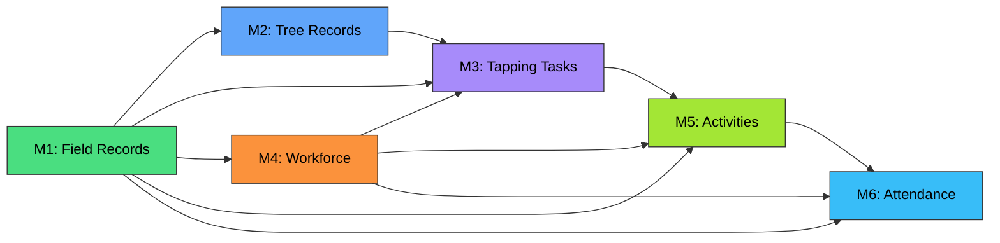

<p align="center">
  
  
  
  
  
  
  
  
</p>

# 🌿 RPMS — Rubber Plantation Management System

> **Design & Architecture Repository**
> Complete system design artifacts for an enterprise-grade rubber plantation management platform — database schemas, architecture diagrams, ER models, and technical specifications.

---

## Table of Contents

- [Project Overview](#project-overview)
- [System Architecture](#system-architecture)
- [Phase 1 Modules](#phase-1-modules)
- [Database Design Summary](#database-design-summary)
- [Technology Stack](#technology-stack)
- [Repository Structure](#repository-structure)
- [Module Quick Links](#module-quick-links)
- [Getting Started](#getting-started)
- [Cross-Module Relationships](#cross-module-relationships)
- [Design Principles](#design-principles)
- [Related Repositories](#related-repositories)
- [Roadmap](#roadmap)
- [License](#license)

---

## Project Overview

RPMS is a comprehensive enterprise platform for managing rubber plantation operations end-to-end — from planting and tree tracking through daily tapping operations to workforce management and payroll-ready attendance. The system integrates modern technologies across the full stack:

| Capability | Technology |
|---|---|
| **IoT Integration** | Smart tapping knives, GPS wearables, NFC tree tags, rain gauges, BLE geofence beacons |
| **Blockchain** | Hyperledger Fabric for tamper-proof yield provenance, attendance records, sustainability certification |
| **Generative AI** | Natural language querying (RAG copilot), photo analysis (tapping quality, disease detection), yield prediction |
| **AR/MR** | Mobile AR tree data overlay, tapping cut guides, MR training stations, VR stakeholder walkthroughs |
| **Mobile** | Kotlin Multiplatform with Jetpack Compose — full native Android access for BLE, NFC, CameraX, GPS |

### Why RPMS?

Traditional rubber plantation management relies on paper-based records, manual muster rolls, and disconnected spreadsheets. RPMS digitizes the entire operation with field-level GPS tracking, real-time IoT telemetry, AI-powered insights, and blockchain-anchored traceability — all accessible from a tapper's Android phone to a manager's web dashboard.

---

## System Architecture

> 📄 **Interactive diagram**: Open [`architecture/rpms_high_level_architecture.html`](architecture/rpms_high_level_architecture.html) in a browser for the full 4-tab interactive architecture view.

The system follows an **event-driven microservices architecture** with edge computing:

```
┌─────────────────────────────────────────────────────────────────────┐
│  EDGE / FIELD DEVICES                                               │
│  Smart Knife · GPS Band · NFC Tags · Rain Gauge · AR/MR · Scale    │
└──────────────────────────────┬──────────────────────────────────────┘
                               ▼
┌─────────────────────────────────────────────────────────────────────┐
│  FIELD EDGE GATEWAY  (per plantation — K3s)                         │
│  Mosquitto MQTT · Apache Camel · SQLite Cache · Biometric Unit      │
└──────────────────────────────┬──────────────────────────────────────┘
                               ▼
┌─────────────────────────────────────────────────────────────────────┐
│  MOBILE & WEB CLIENTS                                               │
│  Tapper App (KMP) · Supervisor App (KMP) · Dashboard (Angular 18)   │
└──────────────────────────────┬──────────────────────────────────────┘
                               ▼
┌─────────────────────────────────────────────────────────────────────┐
│  API GATEWAY & SECURITY                                             │
│  Spring Cloud Gateway · Keycloak (OAuth2/OIDC) · Rate Limiting      │
└──────────────────────────────┬──────────────────────────────────────┘
                               ▼
┌─────────────────────────────────────────────────────────────────────┐
│  MICROSERVICES  (Java 21 + Virtual Threads)                         │
│  Plantation · Tree · Tapping · Workforce · Activity · Attendance    │
│  (Spring Boot 3)   (Quarkus)   (Quarkus)             (Quarkus)     │
└──────────────────────────────┬──────────────────────────────────────┘
                               ▼
┌─────────────────────────────────────────────────────────────────────┐
│  INTEGRATION & EVENT BACKBONE                                       │
│  Apache Kafka · Apache Camel · Debezium CDC · Temporal.io Sagas     │
└──────────────────────────────┬──────────────────────────────────────┘
                               ▼
┌──────────────────────────────┬──────────────────────────────────────┐
│  AI / ML & BLOCKCHAIN        │  DATA & STORAGE                      │
│  Gen AI Copilot (LangChain)  │  PostgreSQL 16 + PostGIS             │
│  Vision (PyTorch/FastAPI)    │  TimescaleDB (IoT time-series)       │
│  Yield Prediction (XGBoost)  │  Redis 7 (cache)                     │
│  Anomaly Detection           │  Elasticsearch 8 (search)            │
│  Hyperledger Fabric          │  MinIO/S3 (objects) · pgvector (RAG) │
└──────────────────────────────┴──────────────────────────────────────┘
```

---

## Phase 1 Modules

Phase 1 covers six core operational modules. Each module's database design is complete with DDL, interactive diagrams, and Mermaid ER models.

| # | Module | Description | Tables | Views | Triggers |
|---|---|---|---|---|---|
| M1 | [Plantation Field Records](#m1-plantation-field-records) | Land classification, fields, nurseries, clone distribution, spatial boundaries | 9 + 6 lu | 5 | 4 |
| M2 | [Tree Records & Tracking](#m2-tree-records--tracking) | Individual tree lifecycle, growth, disease, treatment, mortality, NFC/RFID tags | 11 + 7 lu | 4 | 5 |
| M3 | [Tapping Task Monitoring](#m3-tapping-task-monitoring) | Daily tapping tasks, latex collection, quality testing, IoT telemetry, yield analytics | 11 + 6 lu | 4 | 6 |
| M4 | [Workforce Management](#m4-workforce-management) | Worker lifecycle, skills, gangs, leave, training, pay structure, safety | 12 + 10 lu | 4 | 4 |
| M5 | [Daily Activity Monitoring](#m5-daily-activity-monitoring) | All plantation activities, material usage, photo evidence, inspections, AI analysis | 9 + 5 lu | 4 | 6 |
| M6 | [Attendance Management](#m6-attendance-management) | Multi-method attendance, shift roster, overtime, regularization, monthly payroll | 8 + 5 lu | 4 | 5 |
| | **TOTAL** | | **60 + 39 lu** | **25** | **30** |

---

## Database Design Summary

```
Database Engine:    PostgreSQL 16 + PostGIS 3.4 + TimescaleDB + pgvector
Core Tables:        60
Lookup Tables:      39  (all pre-seeded with rubber plantation domain data)
Views:              25  (dashboards, analytics, alerts, payroll-ready)
Triggers:           30  (auto-calc, auto-sync, GPS, audit logging)
Geometry Types:     Point (trees, GPS), LineString (routes), Polygon (fields, geofence)
Partitioning:       iot_sensor_reading — range partitioned by month
Generated Columns:  worker.full_name, worker_leave_balance.remaining_days
Blockchain Fields:  blockchain_tx_hash on status logs, attendance, yield provenance
AI/ML Fields:       JSONB ai_analysis_result, ai_anomaly_flag, ai_efficiency_score
```

### Module Dependency Chain



---

## Technology Stack

| Layer | Technology | Purpose |
|---|---|---|
| Backend (CRUD) | Java 21 + Spring Boot 3 | Plantation, Tree, Workforce, Notification, Reporting services |
| Backend (High-throughput) | Java 21 + Quarkus | Tapping, Activity, Attendance services (10× faster startup) |
| Integration (Edge) | Apache Camel 4 + Mosquitto MQTT | MQTT→Kafka bridging, protocol mediation, store-and-forward |
| Integration (Cloud) | Apache Camel 4 | Weather APIs, ERP sync, government reporting, payment gateways |
| Event Backbone | Apache Kafka + Schema Registry | Domain events, loose coupling, event replay |
| CDC | Debezium | PostgreSQL WAL → Kafka for real-time sync |
| Saga Orchestration | Temporal.io | Cross-service transactions (worker transfer, replanting workflows) |
| Mobile | Kotlin Multiplatform + Jetpack Compose | Android-native BLE, NFC, CameraX, GPS; SQLDelight offline DB; Ktor networking |
| Web Dashboard | Angular 18 + ngx-mapbox-gl + ngx-charts | Reactive Forms, RxJS real-time streams, spatial visualization |
| API Gateway | Spring Cloud Gateway | Rate limiting, circuit breaking, JWT validation |
| Auth | Keycloak | OAuth2/OIDC, multi-tenant, role hierarchy (TAPPER→ADMIN) |
| Database | PostgreSQL 16 + PostGIS | Operational data, spatial queries, 60+ tables |
| Time-Series | TimescaleDB | IoT sensor telemetry (partitioned hypertables) |
| Vector Store | pgvector | AI embeddings for RAG-based Gen AI copilot |
| Cache | Redis 7 | Tree profile lookups, sessions, rate limiting, pub/sub |
| Search | Elasticsearch 8 | Full-text search, log aggregation, Kibana dashboards |
| Object Storage | MinIO / S3 | Photos, documents, certificates, AI model artifacts |
| AI/ML | Python + FastAPI + PyTorch + LangChain | Photo analysis, yield prediction, anomaly detection, Gen AI copilot |
| Blockchain | Hyperledger Fabric | Private chain for yield provenance, attendance anchoring |
| Observability | OpenTelemetry + Grafana + Prometheus + Loki + Tempo | Traces, metrics, logs, distributed tracing |
| CI/CD | GitHub Actions + ArgoCD + Terraform | GitOps deployment to Kubernetes |
| Container Orchestration | Kubernetes (EKS/GKE) + K3s (edge) | Cloud production + lightweight plantation-edge clusters |

---

## Repository Structure

```
rpms-design/
│
├── README.md                               ← You are here
├── RPMS_PROJECT_CONTEXT.md                 ← Session continuity document
│
├── architecture/
│   ├── rpms_high_level_architecture.html    ← Interactive 4-tab architecture diagram
│   ├── rpms_artifact_storage_strategy.html  ← Storage strategy & repo structure
│   ├── architecture-decisions/
│   │   ├── ADR-001-database-choice.md
│   │   ├── ADR-002-spring-vs-quarkus.md
│   │   ├── ADR-003-event-backbone.md
│   │   ├── ADR-004-angular-over-react.md
│   │   └── ADR-005-kmp-over-flutter.md
│   └── deployment-topology.mermaid
│
├── database/
│   ├── module-1-field-records/
│   │   ├── plantation_field_records_ddl.sql
│   │   ├── plantation_db_design_diagrams.html
│   │   ├── plantation_er_diagram.mermaid
│   │   └── README.md
│   ├── module-2-tree-records/
│   │   ├── tree_records_tracking_ddl.sql
│   │   ├── tree_records_tracking_diagrams.html
│   │   ├── tree_records_tracking_er.mermaid
│   │   └── README.md
│   ├── module-3-tapping-task/
│   │   ├── tapping_task_monitoring_ddl.sql
│   │   ├── tapping_task_monitoring_diagrams.html
│   │   ├── tapping_task_monitoring_er.mermaid
│   │   └── README.md
│   ├── module-4-workforce/
│   │   ├── workforce_management_ddl.sql
│   │   ├── workforce_management_diagrams.html
│   │   ├── workforce_management_er.mermaid
│   │   └── README.md
│   ├── module-5-daily-activity/
│   │   ├── daily_activity_monitoring_ddl.sql
│   │   ├── daily_activity_monitoring_diagrams.html
│   │   ├── daily_activity_monitoring_er.mermaid
│   │   └── README.md
│   ├── module-6-attendance/
│   │   ├── attendance_management_ddl.sql
│   │   ├── attendance_management_diagrams.html
│   │   ├── attendance_management_er.mermaid
│   │   └── README.md
│   ├── migrations/                          ← Flyway scripts (when dev starts)
│   └── seed-data/                           ← Lookup INSERT scripts
│
├── api-contracts/                           ← OpenAPI 3.0 specs per service
│   ├── plantation-service-openapi.yaml
│   ├── tree-service-openapi.yaml
│   └── ...
│
├── wireframes/                              ← UI mockups (draw.io / Figma)
│   ├── mobile-tapper-app/
│   ├── supervisor-tablet/
│   └── management-dashboard/
│
├── domain-model/                            ← DDD artifacts
│   ├── bounded-contexts.mermaid
│   ├── event-storming-results.md
│   └── domain-glossary.md
│
└── docs/
    ├── technology-radar.md
    ├── non-functional-requirements.md
    ├── security-architecture.md
    └── data-flow-diagrams.md
```

---

## Module Quick Links

### M1: Plantation Field Records

| Artifact | Link |
|---|---|
| DDL Script | [`database/module-1-field-records/plantation_field_records_ddl.sql`](database/module-1-field-records/plantation_field_records_ddl.sql) |
| Interactive Diagrams | [`database/module-1-field-records/plantation_db_design_diagrams.html`](database/module-1-field-records/plantation_db_design_diagrams.html) |
| Mermaid ER | [`database/module-1-field-records/plantation_er_diagram.mermaid`](database/module-1-field-records/plantation_er_diagram.mermaid) |

**Key entities**: `plantation` → `division` → `field` → `clone_master`. Land use breakdown (building, roads, HVC, water). Nurseries (motherbud, polybag, ground) with clone-wise distribution. PostGIS boundaries on plantation, field, nursery.

### M2: Tree Records & Tracking

| Artifact | Link |
|---|---|
| DDL Script | [`database/module-2-tree-records/tree_records_tracking_ddl.sql`](database/module-2-tree-records/tree_records_tracking_ddl.sql) |
| Interactive Diagrams | [`database/module-2-tree-records/tree_records_tracking_diagrams.html`](database/module-2-tree-records/tree_records_tracking_diagrams.html) |
| Mermaid ER | [`database/module-2-tree-records/tree_records_tracking_er.mermaid`](database/module-2-tree-records/tree_records_tracking_er.mermaid) |

**Key entities**: `tree` (BIGSERIAL — millions of trees per estate) with NFC/RFID tags, growth measurements, bark panel progression, health inspections → disease incidents → treatments → mortality. AI photo analysis fields. Blockchain-anchored status change log.

### M3: Tapping Task Monitoring

| Artifact | Link |
|---|---|
| DDL Script | [`database/module-3-tapping-task/tapping_task_monitoring_ddl.sql`](database/module-3-tapping-task/tapping_task_monitoring_ddl.sql) |
| Interactive Diagrams | [`database/module-3-tapping-task/tapping_task_monitoring_diagrams.html`](database/module-3-tapping-task/tapping_task_monitoring_diagrams.html) |
| Mermaid ER | [`database/module-3-tapping-task/tapping_task_monitoring_er.mermaid`](database/module-3-tapping-task/tapping_task_monitoring_er.mermaid) |

**Key entities**: `tapping_schedule` → `tapping_task` (central hub) → `latex_collection_record` → `latex_quality_test`. IoT device registry with partitioned telemetry (TimescaleDB). Weather observations. Tapper performance and field yield daily rollups.

### M4: Workforce Management

| Artifact | Link |
|---|---|
| DDL Script | [`database/module-4-workforce/workforce_management_ddl.sql`](database/module-4-workforce/workforce_management_ddl.sql) |
| Interactive Diagrams | [`database/module-4-workforce/workforce_management_diagrams.html`](database/module-4-workforce/workforce_management_diagrams.html) |
| Mermaid ER | [`database/module-4-workforce/workforce_management_er.mermaid`](database/module-4-workforce/workforce_management_er.mermaid) |

**Key entities**: `worker` (central — referenced by tapper_id across M3/M5/M6) with self-referencing `reports_to_id` hierarchy. `gang` (tapper teams). Skills matrix with proficiency levels and certifications. Leave management with approval workflow and auto-calculated balances. Pay structure (multi-component). Safety incidents. Training records (VR/MR/classroom).

### M5: Daily Activity Monitoring

| Artifact | Link |
|---|---|
| DDL Script | [`database/module-5-daily-activity/daily_activity_monitoring_ddl.sql`](database/module-5-daily-activity/daily_activity_monitoring_ddl.sql) |
| Interactive Diagrams | [`database/module-5-daily-activity/daily_activity_monitoring_diagrams.html`](database/module-5-daily-activity/daily_activity_monitoring_diagrams.html) |
| Mermaid ER | [`database/module-5-daily-activity/daily_activity_monitoring_er.mermaid`](database/module-5-daily-activity/daily_activity_monitoring_er.mermaid) |

**Key entities**: `daily_work_plan` → `daily_activity` (34 activity types across 15 categories) with multi-worker assignment, material consumption tracking (variance auto-calc), geo-tagged photo evidence (JSONB AI analysis), supervisor inspections (AR-assisted, checklist-based). GPS route as LineString geometry. AI anomaly detection and end-of-day narrative generation.

### M6: Attendance Management

| Artifact | Link |
|---|---|
| DDL Script | [`database/module-6-attendance/attendance_management_ddl.sql`](database/module-6-attendance/attendance_management_ddl.sql) |
| Interactive Diagrams | [`database/module-6-attendance/attendance_management_diagrams.html`](database/module-6-attendance/attendance_management_diagrams.html) |
| Mermaid ER | [`database/module-6-attendance/attendance_management_er.mermaid`](database/module-6-attendance/attendance_management_er.mermaid) |

**Key entities**: Two-tier architecture — `attendance_scan_log` (immutable raw events) → `daily_attendance` (derived daily record). Multi-method check-in (biometric, NFC, GPS geofence, mobile app, QR, manual) with reliability scoring. Shift roster. Overtime tracking with multipliers. Regularization workflow (auto-apply on approval). Monthly payroll-ready summary with bonus eligibility. AI anomaly detection (buddy punching, location mismatch).

---

## Getting Started

### Prerequisites

- PostgreSQL 16+ with PostGIS extension
- (Optional) TimescaleDB extension for IoT telemetry tables

### Running the DDL Scripts

Scripts must be executed in module order due to cross-module foreign key dependencies:

```bash
# 1. Enable extensions
psql -U postgres -d rpms -c "CREATE EXTENSION IF NOT EXISTS postgis;"
psql -U postgres -d rpms -c "CREATE EXTENSION IF NOT EXISTS \"uuid-ossp\";"

# 2. Execute in dependency order
psql -U postgres -d rpms -f database/module-1-field-records/plantation_field_records_ddl.sql
psql -U postgres -d rpms -f database/module-2-tree-records/tree_records_tracking_ddl.sql
psql -U postgres -d rpms -f database/module-3-tapping-task/tapping_task_monitoring_ddl.sql
psql -U postgres -d rpms -f database/module-4-workforce/workforce_management_ddl.sql
psql -U postgres -d rpms -f database/module-5-daily-activity/daily_activity_monitoring_ddl.sql
psql -U postgres -d rpms -f database/module-6-attendance/attendance_management_ddl.sql
```

### Viewing Interactive Diagrams

Each module includes an `.html` file with a 4-tab interactive dashboard. Simply open in any modern browser — no server required:

```bash
# Example: Open Module 3 diagrams
open database/module-3-tapping-task/tapping_task_monitoring_diagrams.html
```

Tabs include: ER Diagram, Table Schema cards, Relationships table, and Lifecycle/Workflow flow diagram.

### Viewing Mermaid ER Diagrams

Mermaid `.mermaid` files render natively in GitHub when viewed in the repository. They also work in VS Code (with Mermaid extension), Notion, Confluence, and any Mermaid-compatible tool.

---

## Cross-Module Relationships

The modules are interconnected through foreign keys, forming a cohesive system:

| From Module | To Module | Key FK | Relationship |
|---|---|---|---|
| M1 (Field Records) | M2 (Tree Records) | `field.field_id` → `tree.field_id` | Trees belong to fields |
| M1 (Field Records) | M3 (Tapping Tasks) | `field.field_id` → `tapping_task.field_id` | Tasks operate on fields |
| M1 (Field Records) | M4 (Workforce) | `plantation_id`, `division_id`, `field_id` | Workers assigned to locations |
| M2 (Tree Records) | M3 (Tapping Tasks) | `tree.tree_id` → `tapping_task_tree_detail.tree_id` | Per-tree tapping data via NFC |
| M4 (Workforce) | M3 (Tapping Tasks) | `worker.worker_id` → `tapping_task.tapper_id` | Tappers assigned to tasks |
| M4 (Workforce) | M5 (Activities) | `worker.worker_id` → `daily_activity.assigned_worker_id` | Workers perform activities |
| M4 (Workforce) | M6 (Attendance) | `worker.worker_id` → `daily_attendance.worker_id` | Attendance per worker |
| M4 (Workforce) | M6 (Attendance) | `worker_leave.leave_id` → `daily_attendance.leave_id` | Leave linked to absence |
| M3 (Tapping Tasks) | M5 (Activities) | `tapping_task.task_id` → `daily_activity.tapping_task_id` | Tapping as an activity type |
| M5 (Activities) | M6 (Attendance) | `daily_activity.activity_id` → `daily_attendance.primary_activity_id` | What the worker did that day |

---

## Design Principles

1. **Offline-first everywhere** — SQLite at edge gateway, SQLDelight in mobile, store-and-forward sync
2. **Event-driven decoupling** — Kafka domain events enable loose coupling; future modules subscribe without modifying existing services
3. **Spatial-native** — PostGIS geometry columns (Point, LineString, Polygon) on trees, fields, routes, geofences — not just lat/lon decimals
4. **AI-ready schema** — JSONB columns for flexible AI outputs, dedicated `ai_anomaly_flag` fields, `ai_analysis_result` that accommodates evolving ML models
5. **Blockchain-selective** — `blockchain_tx_hash` on critical audit records only (yield provenance, attendance, status changes) — not on every row
6. **Auto-calculated fields** — 30 triggers handle yield-per-tree, dry rubber from DRC, completion percentages, work hours, leave balances, gang sizes — zero application-layer math needed
7. **Pre-seeded domain data** — All 39 lookup tables include rubber plantation-specific INSERT statements (clone classes, tapping systems, disease catalog, chemical treatments, pay components)
8. **Future-phase extensibility** — Module boundaries are clean; new modules (Financial, Processing, Supply Chain) add new services and subscribe to existing Kafka events

---

## Related Repositories

| Repository | Description | Status |
|---|---|---|
| **rpms-design** (this repo) | Design artifacts, DDL, diagrams, architecture | ✅ Active |
| **rpms-backend** | Microservices source code (Spring Boot + Quarkus + AI) | 🔲 Not started |
| **rpms-mobile** | KMP shared module + Android app (Compose) + Angular dashboard | 🔲 Not started |

---

## Roadmap

### Phase 1 — Core Operations *(current)*

- [x] Database schema design — all 6 modules
- [x] High-level system architecture
- [x] Technology stack decisions
- [x] Artifact storage strategy
- [ ] API contract design (OpenAPI specs per service)
- [ ] Kafka event catalog (producers, consumers, Avro schemas)
- [ ] Angular module structure and component hierarchy
- [ ] KMP shared module design (domain models, Ktor client)
- [ ] Keycloak realm, roles, and permission matrix
- [ ] Wireframes / UI mockups
- [ ] Non-functional requirements document
- [ ] Security architecture document

### Phase 2+ — Future Modules *(planned)*

- [ ] Financial Accounting & Payroll
- [ ] Rubber Processing & Factory Operations
- [ ] Supply Chain & Sales Management
- [ ] Inventory & Store Management
- [ ] Sustainability & Certification Management
- [ ] Executive BI & Reporting Portal

---

## License

This repository contains proprietary design artifacts for the RPMS project. All rights reserved.

---

<p align="center">
  <sub>Designed with care for the global rubber plantation industry 🌿</sub>
</p>
